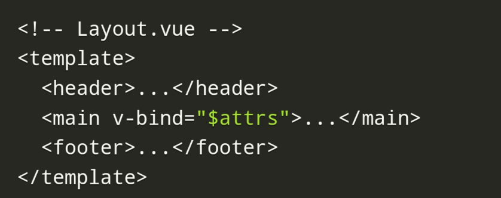
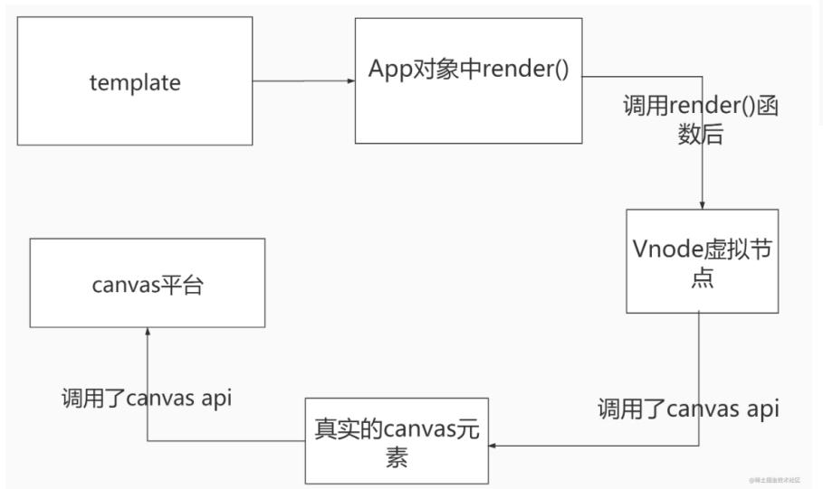
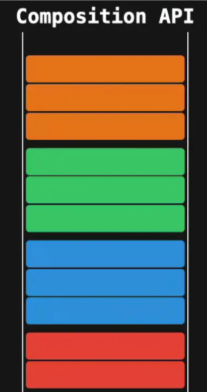
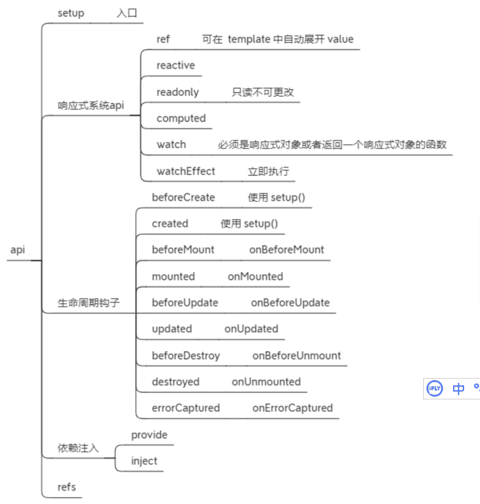

# vue3对于vue2

利用新的语言特性（es6）解决架构问题

## 哪些变化

- 速度更快
- 体积更小
- 更易维护
- 更接近原生
- 更易使用

### 速度更快

vue3相比vue2

- 重写了虚拟Dom的实现
- 编译模板的优化
- 更高效的组件初始化
- undate性能提高1.3~2倍
- SSR速度提高了2~3倍

## 体积更小

使用了摇树优化

>  摇树优化是**一种实现移除未引用代码（dead code elimination）的方式**，实现的方式是检测哪些导出项（export）在应用代码里未被引用。 它会被类似Webpack 和Rollup 这样的打包工具执行，最早由Rollup 实现。 

## 3.更易维护

- composition Api（组合式api）
- vue3基于typescript编写，享受自动类型定义提示

https://cn.vuejs.org/guide/typescript/overview.html

## 4.更接近原生

自定义渲染api

https://cn.vuejs.org/api/custom-renderer.html#custom-renderer-api

# 三、vue3新特性

frampent

Teleport

composition Api

createRenderer

## 1.framents

vue3中现在支持多个根节点



## 2. Teleport 

 `Teleport ` 是一个内置组件，它可以将一个组件内部的一部分模板“传送”到该组件的 DOM 结构外层的位置去。 

https://cn.vuejs.org/guide/built-ins/teleport.html

## 3.createRenderer

通过createRenderer,我们能够构建自定义渲染器，我们能够将vue的开发模式扩展到其他平台上

我们可以将其生成在canvas画布上



https://cn.vuejs.org/api/custom-renderer.html#custom-renderer-api

## 4.组合式api

composition Api，也就是组合式api，通过这种形式，我们能够更加容易维护我们的代码，将相同功能的变量进行一个集中式的管理



关于composition api使用，这里以下图展开



# 三、非兼容变更

## Global API

- 全局Vue API已更改为使用应用程序实例
- 全局和内部API已经被重构为可tree-shakable

## 模板指令

### 1.组件上的v-model用法已更改

v-for节点上的key用法已更改

### 2.在同一元素上使用的v-if和v-for优先级已更改

vue3: 当它们同时存在于一个节点上时，`v-if` 比 `v-for` 的优先级更高。 

在外新包装一层 ` 再在其上使用 `v-for` 可以解决这个问题 (这也更加明显易读)：

<template v-for="todo in todos">
  <li v-if="!todo.isComplete">
    {{ todo.name }}
  </li>
</template>

### 3.v-bind="object"现在排序敏感

假设我们有一个object变量和一个color变量，它们的值分别是：

```js
const object = {
  style: {
    color: 'red',
    fontSize: '20px'
  }
}

const color = 'green'
```

在vue2中，如果我们在一个元素上使用v-bind="object"和:style="{color}"，那么color变量会覆盖object中的style.color，无论它们的顺序如何。例如：

```html
<div v-bind="object" :style="{color}">Hello</div>
<!-- 或 -->
<div :style="{color}" v-bind="object">Hello</div>
<!-- 都会渲染成 -->
<div style="color: green; font-size: 20px;">Hello</div>
```

在vue3中，如果我们在一个元素上使用v-bind="object"和:style="{color}"，那么它们的顺序会决定它们如何合并。如果object中的绑定在color之前声明，那么它们会被覆盖，反之则不会。例如：

```html
<div v-bind="object" :style="{color}">Hello</div>
<!-- 会渲染成 -->
<div style="color: green; font-size: 20px;">Hello</div>

<div :style="{color}" v-bind="object">Hello</div>
<!-- 会渲染成 -->
<div style="color: red; font-size: 20px;">Hello</div>
```

### 4.v-for中的ref不再注册ref数组

#### vue3中如何利用ref访问组件实例的方法是：

- 在父组件中定义一个ref变量，例如`const childRef = ref(null)`
- 在父组件中将ref变量绑定到子组件上，例如`<Child ref="childRef" />`
- 在父组件中通过ref变量的value属性访问子组件实例，例如`childRef.value.doSomething()`
- 注意，子组件实例只有在子组件渲染完成后才能访问，因此需要在onMounted或者onUpdated等生命周期钩子中使用¹²³⁴⁵。

#### 为什么vue3中v-for中的ref不再注册ref数组

- 在vue2中，v-for中的ref会自动创建一个数组，但是这个数组并不是响应式的，也就是说当v-for的数据源发生变化时，这个数组不会自动更新，可能会导致内存泄漏或者引用错误。

- 在vue3中，v-for中的ref需要我们手动绑定到一个函数上，在函数中可以灵活地处理ref，例如在onBeforeUpdate钩子中清空ref数组，在onUpdated钩子中打印ref数组等。

- 这样的改变可以让我们更好地控制ref的获取和释放，避免内存泄漏和不必要的渲染，也可以让我们更方便地对ref进行操作和监听12。

  假设我们有一个list变量，它的值是：

  ```js
  const list = ['apple', 'banana', 'orange']
  ```

  在vue2中，如果我们在v-for中使用ref属性，那么会在$refs中自动创建一个数组，包含所有循环的元素的引用。例如：

  ```html
  <div v-for="item in list" :key="item" ref="items">{{ item }}</div>
  ```

  在vue3中，如果我们在v-for中使用ref属性，那么需要我们手动绑定到一个函数上，在函数中可以灵活地处理ref。例如：

  ```html
  <div v-for="item in list" :key="item" :ref="setItemRef">{{ item }}</div>
  ```

  ```js
  import { ref, onBeforeUpdate, onUpdated } from 'vue'
  
  export default {
    setup() {
      let items = ref([])
      const setItemRef = (el) => {
        if (el) {
          items.value.push(el)
        }
      }
      onBeforeUpdate(() => {
        items.value = []
      })
      onUpdated(() => {
        console.log(items.value) // 打印所有循环的元素的引用
      })
      return {
        setItemRef
      }
    }
  }
  ```

### 组件

- #### 只能使用普通函数创建功能组件

  根据我的搜索结果，vue3只能使用普通函数创建功能组件的理解是：

  - 功能组件是一种没有状态、没有实例、只接收 props 和 context 作为参数的组件，它们可以提高渲染性能和代码可读性¹。
  - 在vue2中，可以使用 { functional: true } 组件选项来定义一个功能组件，例如：

  ```html
  <template functional>
    <div>{{ props.msg }}</div>
  </template>
  ```

  - 在vue3中，不再支持 { functional: true } 组件选项，而是推荐使用无状态的函数式组件 (SFC) ，即一个只导出了 render 函数的单文件组件²³，例如：

  ```html
  <script>
  export default {
    props: {
      msg: String
    },
    render() {
      return h('div', this.msg)
    }
  }
  </script>
  ```

  - 这样的改变是为了简化功能组件的语法和使用方式，同时也为了与 Composition API 的风格保持一致³。

  

- #### 异步组件现在需要definAsyncComponent方法来创建

### 渲染函数

- 渲染函数Api改变

- $scopedSlots property已删除，所有插槽都通过$slots作为函数暴露

- 自定义指令API已改为与组件生命周期一致

- 一些转移class被重命名了(动画)：

  v-enter -> v-enter-from

  v-leave -> v-leave-from

- 组件watch选项和实例方法$watch不再支持点分隔字符串路径，请改用计算函数作为参数

- 在vue2.x中，应用根容器的outerHTML将替换为根组件模板（如果根组件没有模板/渲染选项，则最终编译为模板）。vue3.x现在使用应用容器的innerHTML。

### 其他小改变

- destoryed生命周期选项被重命名为unmounted
- beforeDestroy生命周期选项被重命名为beforeUnmount
- prop default工厂函数不再有权访问this上下文
- 自定义指令API已改为与组件生命周期一致
- data应始终声明为函数
- 来自mixin的data选项现在可简单地合并
- attribute强制策略已更改
- 一些过渡class被重命名
- 组件watch选项和实例方法$watch不再支持以点分隔的字符串路径。请改用计算属性函数作为参数。
- 没有特殊指令的标记（v-if、else-if、else、v-for或v-slot）现在被视为普通元素，并将生成原生的元素，而不是渲染其内部内容。
- 在vue2.x中，应用根容器的outerHTML将替换为根组件模板（如果根组件没有模板/渲染选项，则最终编译为模板）。vue3.x现在使用应用容器的innerHTML，这意味着容器本山不再被视为模板的一部分。

### 移除API

- keyCode支持作为v-on的修饰符
- $on,$off和$once实例方法
- 过滤filter
- 内联模板attribute
- $destroy实例方法。用户不应再手动管理单个Vue组件的生命周期